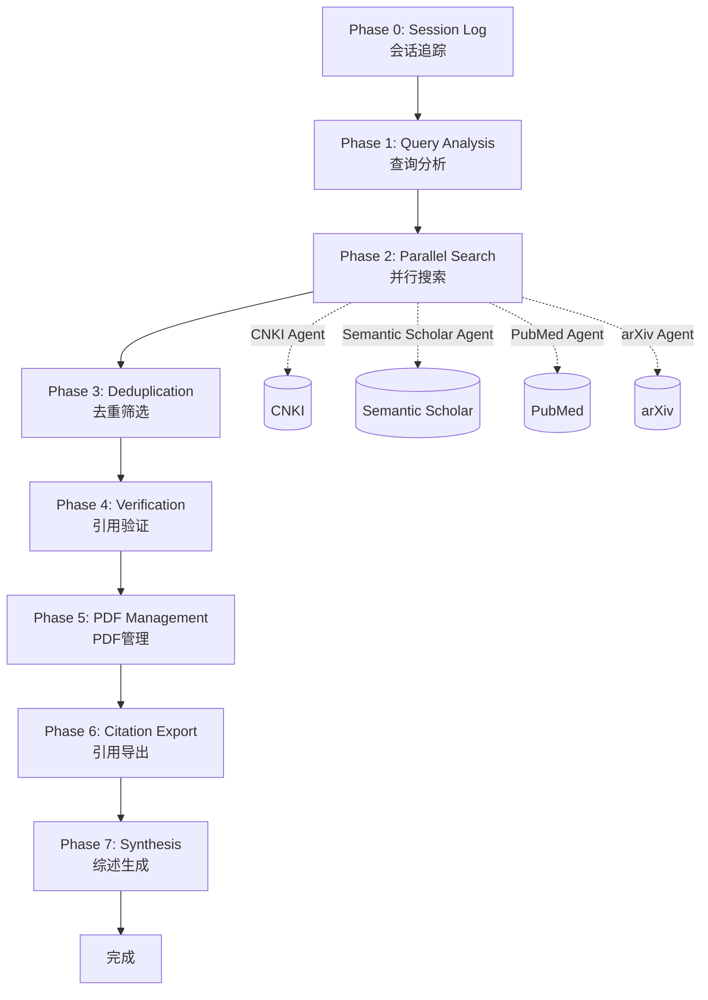
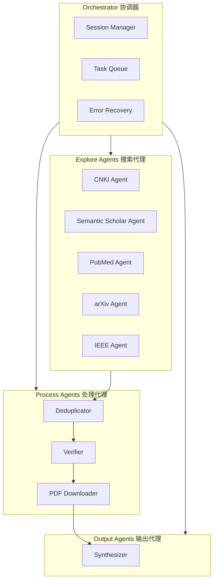

# Literature Survey Skill

<p align="center">
  
  
  
  
</p>

<p align="center">
  <b>系统性学术文献回顾（Literature Survey）Skill for Kimi CLI</b>
</p>

<p align="center">
  采用 8阶段工作流 和 Agent Swarm 并行架构，支持中英文多数据库检索，输出 GB/T 7714-2015 和 BibTeX 格式
</p>

---

## 📖 简介

**Literature Survey Skill** 是一个为 Kimi CLI 设计的 Skill 插件，用于帮助用户进行系统性的学术文献回顾。它整合了来自多个优秀开源项目的最佳实践，提供了一套完整的文献调研工作流。

### ⚠️ 当前状态

> **版本**: v2.0.0 (Beta)  
> **状态**: 核心框架已完成，部分功能待实现

| 模块 | 状态 | 说明 |
|------|------|------|
| AI关键词提取 | 🟡 部分可用 | 框架完成，需接入LLM客户端 |
| AI策略规划 | 🟡 部分可用 | 框架完成，需接入LLM客户端 |
| 数据库搜索 | 🔴 待实现 | 适配器待开发 |
| 文献去重 | 🟢 可用 | 已实现 |
| 引用管理 | 🟢 可用 | 已实现（含f-string bug待修复） |
| 综述生成 | 🔴 待实现 | 框架待完成 |
| 工作流主控 | 🟡 部分可用 | 核心流程完成，部分Phase待实现 |

**已知问题**: 详见 [BUG.md](./BUG.md)

### 核心优势

- 🚀 **8阶段工作流**：从查询分析到综述生成的完整流程
- 🤖 **Agent Swarm 架构**：并行多数据库检索，提升效率
- ✅ **引用验证机制**：防止幻觉引用，确保文献真实性
- 🌐 **多数据库支持**：CNKI、Semantic Scholar、PubMed、arXiv 等 17+ 平台
- 📚 **多格式输出**：GB/T 7714-2015、BibTeX、RIS、Zotero
- 🔄 **中断续传**：支持会话保存和恢复

---

## ✨ 功能特性

### 已实现功能

| 功能模块 | 描述 | 状态 |
|---------|------|------|
| 🔍 基础关键词提取 | 基于规则的关键词匹配 | ✅ 可用 |
| 🔍 **AI关键词提取** | LLM驱动的双语关键词提取 | 🟡 框架完成，待接入LLM |
| 🤖 **AI策略规划** | 自动识别领域、选择数据库 | 🟡 框架完成，待接入LLM |
| 🌏 中文文献检索 | CNKI 高级检索 | 🔴 适配器待实现 |
| 🌍 英文文献检索 | Semantic Scholar、PubMed等 | 🔴 适配器待实现 |
| 🔄 智能去重 | DOI/标题/元数据匹配 | ✅ 可用 |
| ✅ 引用验证 | Crossref、OpenAlex验证 | ✅ 可用 |
| 📄 PDF 管理 | 开放获取检查 | 🟡 框架完成 |
| 📝 引用格式化 | GB/T 7714-2015、BibTeX | 🟡 可用（有语法bug） |
| 📝 **引用交叉引用** | Word书签/Markdown链接 | ✅ 可用 |
| 📤 Zotero 同步 | 批量导出 | ✅ 可用 |
| 📊 综述生成 | 主题聚类、Gap识别 | 🔴 待实现 |
| ⚙️ **动态配置管理** | YAML配置+环境变量 | ✅ 可用 |
| 🔄 **AI工作流** | 端到端自动化流程 | 🟡 部分可用 |

**图例**: ✅ 可用 | 🟡 部分可用 | 🔴 待实现

### 新特性 (v2.0)

1. **AI驱动流程**: 使用LLM自动提取关键词、规划检索策略
2. **双语支持**: 中英文关键词同时提取，支持中英文学术数据库
3. **交叉引用**: 支持Word文档书签跳转和Markdown超链接
4. **动态路径**: 模板化路径配置，支持运行时变量解析
5. **配置管理**: 统一的YAML配置 + 环境变量支持

---

## 🔄 8阶段工作流



### 各阶段详细说明

| 阶段 | 名称 | 主要任务 | 输出 |
|------|------|---------|------|
| 0 | Session Log | 创建会话目录，初始化日志 | `session_log.md` |
| 1 | Query Analysis | 关键词提取、同义词扩展、检索式构建 | `keywords.json`, `queries.json` |
| 2 | Parallel Search | 多数据库并行检索 | 原始搜索结果 |
| 3 | Deduplication | 去重、质量筛选、统一数据模型 | 去重后的文献列表 |
| 4 | Verification | DOI验证、预印本检查、撤稿检测 | 验证后的文献列表 |
| 5 | PDF Management | PDF下载、文件组织 | 本地PDF文件 |
| 6 | Citation Export | 引用格式化、多格式导出 | `.bib`, `.ris`, `.json` |
| 7 | Synthesis | 主题聚类、综述撰写 | `literature_review.md` |

---

## 🚀 快速开始

### 安装

1. 将本 Skill 复制到 Kimi CLI 的 skills 目录：

```bash
cd ~/.kimi/skills  # 或你的 Kimi CLI skills 目录
git clone https://github.com/your-username/literature-survey.git
```

2. 安装依赖：

```bash
pip install pyyaml aiohttp aiofiles
```

3. 配置环境变量：

```bash
cp .env.example .env
# 编辑 .env 文件，填入您的API Keys
```

必需的环境变量：
- `OPENAI_API_KEY` - OpenAI API密钥
- `ANTHROPIC_API_KEY` - Anthropic API密钥（可选）
- `EXA_API_KEY` - EXA API密钥

4. 配置文件（可选）：

```bash
cp config.yaml config.local.yaml
# 编辑 config.local.yaml 自定义配置
```

### 使用方法

在 Kimi CLI 中输入触发关键词：

```
/ 文献回顾 基于深度学习的医学图像诊断研究
```

或：

```
/ 帮我找文献 Transformer模型在自然语言处理中的应用
```

### 使用脚本工具

#### AI工作流（推荐）

```python
import asyncio
from scripts import run_workflow

async def main():
    results = await run_workflow(
        query="基于深度学习的医学图像诊断研究",
        year_range=(2020, 2024),
        num_papers=50,
        language="both",
        interactive=True  # 交互式配置
    )
    
    print(f"会话ID: {results['session_id']}")
    print(f"识别领域: {results['phases']['strategy_planning']['domain']}")

asyncio.run(main())
```

#### 基础关键词提取

```python
from scripts import KeywordExtractor

extractor = KeywordExtractor()
report = extractor.analyze("基于深度学习的医学图像诊断研究", domain="medicine")

print(f"中文关键词: {report['keywords']['zh']}")
print(f"CNKI检索式: {report['search_queries']['cnki']}")
```

#### AI关键词提取

```python
import asyncio
from scripts import extract_keywords

async def main():
    result = await extract_keywords(
        query="基于深度学习的医学图像诊断研究",
        year_range=(2020, 2024),
        target_language="both"
    )
    
    print(f"英文关键词: {result.keywords.en.primary}")
    print(f"中文关键词: {result.keywords.zh.primary}")
    print(f"推荐数据库: {result.suggested_databases}")

asyncio.run(main())
```

#### 引用格式化与交叉引用

```python
from scripts import create_citation_manager

# 创建引用管理器（支持交叉引用）
manager = create_citation_manager(
    style="gb7714",
    cross_ref="bookmark"  # bookmark/hyperlink/both
)

# 添加文献
paper = {
    "title": "Deep learning for image recognition",
    "authors": ["Y LeCun", "Y Bengio", "G Hinton"],
    "journal": "Nature",
    "year": 2015,
    "doi": "10.1038/nature14539",
    "language": "en"
}
manager.add_paper(paper)

# 生成引用
print(manager.format_citation("E1"))  # [E1]
print(manager.format_citation(["E1"], format_type="bookmark"))  # Word书签链接

# 生成参考文献列表
print(manager.generate_reference_list("markdown"))
```

---

## 📁 项目结构

```
literature-survey/
├── SKILL.md                          # Skill 主入口
├── README.md                         # 本文件
├── AGENTS.md                         # 项目说明文档
├── BUG.md                            # Bug 报告和修复路线图 ⭐新增
├── OPTIMIZATION_SUMMARY.md           # 优化总结 ⭐新增
├── config.yaml                       # 配置文件模板 ⭐新增
├── .env.example                      # 环境变量示例 ⭐新增
│
├── agents/                           # Agent 模板
│   ├── explore-agent.md              # 搜索 Agent
│   ├── verify-agent.md               # 验证 Agent
│   ├── download-agent.md             # 下载 Agent
│   ├── synthesize-agent.md           # 综述 Agent
│   └── orchestrator.md               # 协调器 Agent
│
├── scripts/                          # 辅助脚本
│   ├── __init__.py                   # 包初始化
│   ├── models.py                     # 统一数据模型
│   ├── utils.py                      # 工具函数
│   │
│   ├── ai_keyword_extractor.py       # AI关键词提取 ⭐新增
│   ├── ai_strategy_planner.py        # AI策略规划 ⭐新增
│   ├── ai_workflow.py                # AI工作流主控 ⭐新增
│   ├── citation_manager.py           # 引用管理器(交叉引用) ⭐新增
│   ├── config_manager.py             # 配置管理器 ⭐新增
│   │
│   ├── keyword_extractor.py          # 基础关键词提取
│   ├── citation_formatter.py         # 引用格式化
│   ├── verify_references.py          # 引用验证
│   ├── deduplicate_papers.py         # 文献去重
│   ├── sync_zotero.py                # Zotero同步
│   ├── session_manager.py            # 会话管理
│   └── README.md                     # 脚本使用指南
│
├── references/                       # 参考资料
│   ├── cnki-guide.md                 # CNKI检索指南
│   ├── english-search-guide.md       # 英文数据库指南
│   ├── gb-t-7714-2015.md             # 引用格式规范
│   ├── database-apis.md              # 数据库API参考
│   └── workflow-templates.md         # 工作流模板
│
└── adapters/                         # 数据库适配器 (待实现)
    ├── __init__.py
    ├── exa_adapter.py
    ├── semantic_scholar_adapter.py
    ├── pubmed_adapter.py
    ├── arxiv_adapter.py
    └── cnki_adapter.py
```

---

## 🤖 Agent Swarm 架构



### Agent 特点

- **独立性**：每个 Agent 可以独立运行
- **并行性**：同类型 Agent 可以并行执行
- **容错性**：单个 Agent 失败不影响整体流程
- **可扩展**：易于添加新的数据库 Agent

---

## 🌐 支持的数据库

### 中文数据库

| 数据库 | 类型 | 特点 |
|--------|------|------|
| CNKI 中国知网 | 全文 | CSSCI、北大核心筛选 |
| 万方数据 | 全文 | 期刊、学位论文 |
| 维普 | 全文 | 中文科技期刊 |

### 英文数据库

| 数据库 | 类型 | API | 特点 |
|--------|------|-----|------|
| Semantic Scholar | 学术图谱 | ✅ | 免费、覆盖广 |
| PubMed | 生物医学 | ✅ | 医学权威 |
| arXiv | 预印本 | ✅ | CS、物理 |
| IEEE Xplore | 工程 | ✅ | 工程技术 |
| ACM Digital Library | 计算机 | ✅ | 顶会论文 |
| OpenAlex | 开放数据 | ✅ | 开源免费 |
| Crossref | DOI注册 | ✅ | DOI解析 |
| Web of Science | 引文索引 | 🔑 | 权威引文 |
| Scopus | 学术数据库 | 🔑 | 全面覆盖 |

> 🔑 表示需要 API Key

---

## 📝 引用格式支持

### GB/T 7714-2015

中国国家标准，适用于中文学术论文：

```
[C1] 张三, 李四, 王五. 基于深度学习的图像识别研究[J]. 计算机学报, 2023, 46(5): 1023-1035. DOI:10.xxxx.

[E1] LeCun Y, Bengio Y, Hinton G. Deep learning[J]. Nature, 2015, 521(7553): 436-444. DOI:10.1038/nature14539.
```

### BibTeX

适用于 LaTeX 文档：

```bibtex
@article{LeCun2015Deep,
  author = {LeCun, Yann and Bengio, Yoshua and Hinton, Geoffrey},
  title = {Deep learning},
  journal = {Nature},
  year = {2015},
  volume = {521},
  number = {7553},
  pages = {436--444},
  doi = {10.1038/nature14539}
}
```

### RIS

适用于文献管理软件：

```
TY  - JOUR
TI  - Deep learning
AU  - LeCun, Yann
AU  - Bengio, Yoshua
JO  - Nature
PY  - 2015
VL  - 521
IS  - 7553
SP  - 436
EP  - 444
DO  - 10.1038/nature14539
ER  -
```

---

## 📚 参考资料

- `references/cnki-guide.md` - CNKI 高级检索详细指南
- `references/english-search-guide.md` - 英文数据库 API 指南
- `references/gb-t-7714-2015.md` - GB/T 7714-2015 引用格式规范
- `references/database-apis.md` - 各数据库 API 对比
- `references/workflow-templates.md` - 工作流模板参考

---

## 🗺️ 修复路线图

详见 [BUG.md](./BUG.md) 获取完整的bug列表。

### v2.0.1 (紧急修复)

**目标**: 修复阻塞性问题，使核心功能可用

- [ ] **BUG-001** 修复 f-string 语法错误 (`citation_formatter.py`)
- [ ] **BUG-002** 实现 LLM 客户端封装 (OpenAI/Anthropic)

### v2.1.0 (功能完善)

**目标**: 完成核心工作流功能

- [ ] **BUG-003** 实现工作流各Phase功能
  - [ ] Phase 3: 并行文献搜索
  - [ ] Phase 4: 智能去重集成
  - [ ] Phase 6: 综述生成模块
- [ ] **BUG-004** 实现数据库适配器
  - [ ] EXA 适配器
  - [ ] Semantic Scholar 适配器
  - [ ] PubMed 适配器
  - [ ] arXiv 适配器
  - [ ] CNKI 适配器
- [ ] **ENH-002** 添加标准日志系统

### v2.2.0 (质量提升)

**目标**: 提升代码质量和健壮性

- [ ] **BUG-005** 修复代码规范问题
- [ ] **BUG-006** 生产环境禁用模拟数据
- [ ] **BUG-007** 添加路径循环引用检测
- [ ] **BUG-008** 完善异步错误处理
- [ ] **ENH-001** 添加单元测试覆盖
- [ ] **ENH-003** 添加进度指示器

### v3.0.0 (正式发布)

**目标**: 稳定版本发布

- [ ] 完整文档和教程
- [ ] 性能优化
- [ ] 支持更多数据库
- [ ] GUI界面（可选）

---

## 🤝 致谢

本项目在开发过程中参考和整合了以下优秀开源项目的思路和设计：

### 1. [flonat/claude-research](https://github.com/flonat/claude-research)

**贡献**：
- 8阶段工作流设计理念
- Agent Swarm 并行架构
- 引用验证规则和流程
- Better BibTeX 格式规范
- Session Log 和检查点机制

> "Comprehensive academic literature workflow: discover, verify, organize, synthesize."

### 2. [openclaw/skills](https://github.com/openclaw/skills)

**贡献**：
- 多数据库并行搜索策略
- 智能去重算法设计
- 标准化引用格式输出
- 简洁的 Agent 设计模式

### 3. [cookjohn/cnki-skills](https://github.com/cookjohn/cnki-skills)

**贡献**：
- CNKI 自动化检索实现
- 验证码处理机制
- 期刊影响因子查询
- Zotero 导出集成
- Chrome DevTools MCP 集成方案

### 4. [diegosouzapw/awesome-omni-skill](https://github.com/diegosouzapw/awesome-omni-skill)

**贡献**：
- 统一 Paper 数据模型设计
- 14+ 学术平台接口整合
- 速率限制管理方案
- 错误处理和重试机制
- 标准化数据接口

感谢以上项目的作者们为学术工具开源社区做出的贡献！

---

## 📄 许可证

MIT License

Copyright (c) 2024 Literature Survey Skill Contributors

Permission is hereby granted, free of charge, to any person obtaining a copy
of this software and associated documentation files (the "Software"), to deal
in the Software without restriction, including without limitation the rights
to use, copy, modify, merge, publish, distribute, sublicense, and/or sell
copies of the Software, and to permit persons to whom the Software is
furnished to do so, subject to the following conditions:

The above copyright notice and this permission notice shall be included in all
copies or substantial portions of the Software.

THE SOFTWARE IS PROVIDED "AS IS", WITHOUT WARRANTY OF ANY KIND, EXPRESS OR
IMPLIED, INCLUDING BUT NOT LIMITED TO THE WARRANTIES OF MERCHANTABILITY,
FITNESS FOR A PARTICULAR PURPOSE AND NONINFRINGEMENT. IN NO EVENT SHALL THE
AUTHORS OR COPYRIGHT HOLDERS BE LIABLE FOR ANY CLAIM, DAMAGES OR OTHER
LIABILITY, WHETHER IN AN ACTION OF CONTRACT, TORT OR OTHERWISE, ARISING FROM,
OUT OF OR IN CONNECTION WITH THE SOFTWARE OR THE USE OR OTHER DEALINGS IN THE
SOFTWARE.

---

<p align="center">
  Made with ❤️ for researchers
</p>
